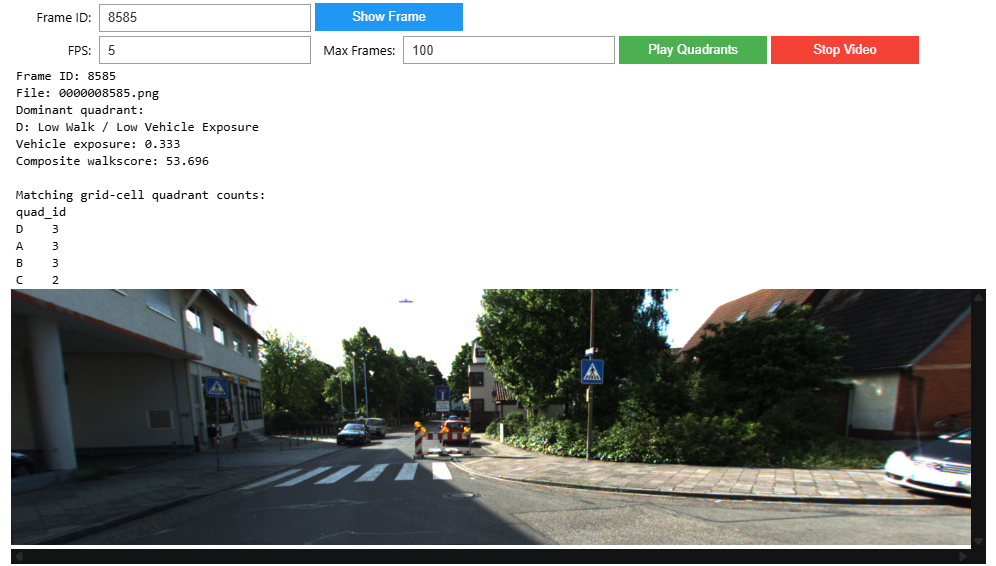

# Walkability Analysis Framework
"Toward an Open Computational Framework for Behavior-Aware Walkability Assessment Using Multi-Source Urban Data" is  a Proof-of-concept demonstration for walkability evaluation that combines built-environment opportunity-based static features with behavior-aware dynamic features to compute the final composite walkability score.


## Overview

This framework implements two complementary approaches to walkability assessment:

- **Static Walkability**: Infrastructure based metrics including intersection density, POI diversity, essential services accessibility, transit proximity, and pedestrian infrastructure (walkways, sidewalks)
- **Dynamic Walkability**: Temporal based metrics analyzing pedestrian and vehicle mobility pattern.


## Project Structure

```
walkability_score/
├── src/                              # Core implementation modules
│   ├── generate_static_data.py       # Static walkability data pipeline
│   ├── generate_dynamic_data.py      # Dynamic walkability data pipeline
│   ├── static_walkscore.py           # Static walkability score computation
│   ├── dynamic_walkscore.py          # Dynamic walkability score computation
│   ├── generate_grid.py              # Spatial grid generation
│   ├── walkability_grid.py           # Grid-based analysis utilities
│   ├── composite_score.py            # Combined score calculation
│   ├── plotter.py                    # Visualization utilities
│   └── helpers.py                    # Common utility functions
│
├── config/                           # Configuration modules
│   ├── static_ws.py                  # Static walkability parameters
│   ├── dynamic_ws.py                 # Dynamic walkability parameters
│   ├── grid.py                       # Spatial grid configuration
│   └── composite.py                  # Composite score configuration
│
├── eval/                             # Evaluation and analysis modules
│   ├── static_feature_eval.py        # Static feature evaluation
│   ├── dynamic_feature_eval.py       # Dynamic feature evaluation
│   ├── sensitivity_test.py           # Sensitivity analysis                    # Report generation
│
├── notebooks/                        # Jupyter notebooks for exploration
│   ├── static_eval.ipynb             # Static evaluation analysis
│   ├── dynamic_eval.ipynb            # Dynamic evaluation analysis
│   ├── redfin.ipynb                  # Redfin comparison and quadrant generation
│   └── interface.ipynb               # Interactive frame lookup and quadrant video interface                # Redfin data analysis
│
├── outputs/                          # Generated outputs
│   ├── static_data.csv               # Computed static walkability scores
│   ├── dynamic_data.csv              # Computed dynamic walkability scores
│   ├── dynamic_spatial_grid_gps.csv  # Grid-based dynamic data
│   └── *.html                        # Interactive maps
│
├── cache/                            # Cached API responses
├── redfin_score/                     # Redfin integration data
├── main.py                           # Main execution pipeline
├── eval.py                           # Evaluation runner
└── README.md                         # This file
```

## Installation

### Requirements

- Python 3.8+
- pandas
- geopandas
- shapely
- numpy
- matplotlib / plotly

### Setup

```bash
# Clone the repository
git clone <repository-url>
cd walkability_score

# Install dependencies
pip install -r requirements.txt
```
# Walkability and Vehicle Exposure Mapping

This project builds a proof-of-concept workflow for evaluating walkability using static urban features, dynamic street-level observations, and Redfin Walk Score comparison. The workflow produces spatial maps, quadrant-based classifications, and an interactive KITTI-360 frame lookup interface for visual inspection.

## Outputs

The `outputs/` folder contains the main generated visualizations:

- `grid_map_static.html`  
  Static walkability map based on built-environment features.

- `grid_map_dynamic.html`  
  Dynamic walkability map based on frame level pedestrian and vehicle mobility pattern.

- `grid_map_composite.html`  
  Composite walkability map combining static and dynamic walkability.

- `grid_map_composite_vs_static.html`  
  Difference map showing where the composite score differs from the static score.

- `grid_map_composite_vs_dynamic.html`  
  Difference map showing where the composite score differs from the dynamic score.

- `walkability_quadrant_map.html`  
  Quadrant map classifying each grid cell by walkability and vehicle exposure.

These maps help identify which areas are dominated by static walkability features, dynamic street activity, or high vehicle exposure.

## Quadrant Classification

A: High Walk / Low Vehicle Exposure
B: High Walk / High Vehicle Exposure
C: Low Walk / High Vehicle Exposure
D: Low Walk / Low Vehicle Exposure

## Interactive Frame Lookup Interface

The interactive interface is available in:

`notebooks/interface.ipynb`

It supports:

- Inspecting one KITTI frame by frame ID



- Showing the dominant quadrant label
- Displaying vehicle exposure and composite walkscore
- Playing all four quadrant videos


.gif)


## Frame Lookup Interface

Run `notebooks/interface.ipynb` to use the interactive frame lookup tool.

The interface lets users enter a KITTI frame ID and returns:

- Dominant quadrant label
- Vehicle exposure: `veh_density_p90`
- Composite walkscore: `walkscore_composite`
- Matching grid-cell quadrant counts
- KITTI frame image

Example output:

```text
Frame ID: 8585
File: 0000008585.png
Dominant quadrant:
D: Low Walk / Low Vehicle Exposure
Vehicle exposure: 0.333
Composite walkscore: 53.696

Matching grid-cell quadrant counts:
D    3
A    3
B    3
C    2

<!-- 
## Usage

### Quick Start

Run the main pipeline to generate walkability scores:

```bash
python main.py
```

This will:
1. Generate or load static walkability data
2. Generate or load dynamic walkability data
3. Create spatial grid analysis
4. Compute combined scores

### Configuration

Customize analysis parameters in the config files:

- **`config/static_ws.py`**: Static feature weights, buffer radius, essential POI tags
- **`config/dynamic_ws.py`**: Dynamic feature parameters and data paths
- **`config/grid.py`**: Grid cell size and margin parameters

### Running Evaluations

```bash
# Run feature evaluation
python eval.py

# Or execute specific evaluation modules
python -c "from eval.static_feature_eval import run_static_feature_eval; run_static_feature_eval()"
```

### Jupyter Notebooks

Explore data and visualizations:

```bash
jupyter notebook notebooks/static_eval.ipynb
jupyter notebook notebooks/dynamic_eval.ipynb
```

## Configuration Parameters

### Static Walkability (config/static_ws.py)

| Parameter | Default | Description |
|-----------|---------|-------------|
| `BUFFER_M` | 300 | Analysis radius in meters |
| `FETCH_PAD_M` | 1200 | Padding around convex hull for data fetching |
| `LANE_WIDTH_M` | 7.0 | Drivable area proxy (2 lanes) |
| `SCALE_M` | 300.0 | Scale normalization factor |

### Features Included

Each feature is weighted equally (1/7 weight each):
- intersection_density_n
- poi_entropy_n
- essential_poi_count_n
- transit_proximity_n
- walkway_n
- sidewalk_n
- drivable_inv_n

## Output Files

- **CSV Files**: Walkability scores with spatial coordinates
- **HTML Maps**: Interactive Folium maps showing:
  - Static walkability distribution
  - Dynamic walkability distribution
  - Composite score comparison
  - Grid-based spatial analysis

## Data Sources

- **OpenStreetMap**: Street networks, POIs, transit infrastructure via Overpass API
- **GPS Data**: Temporal movement patterns (KITTI 360 dataset support)
- **Real Estate Data**: Redfin property data integration (optional)

## Development

### Adding New Features

1. Implement feature computation in appropriate `src/` module
2. Update configuration with feature weights
3. Add evaluation logic to `eval/` modules
4. Update VIF feature lists in config

### Extending to New Regions

1. Update GPS data path in `config/static_ws.py`
2. Adjust `BUFFER_M` and `FETCH_PAD_M` for region size
3. Modify `ESSENTIAL_TAGS` for regional POI priorities
4. Run main pipeline to generate new outputs

## Performance Notes

- Large geographic areas may require multiple Overpass API calls
- Grid generation time scales with cell count
- Cached API responses stored in `cache/` directory
- Consider data filtering for regions larger than 10 km²

## License

[Specify your license here]

## Contributing

[Add contribution guidelines if applicable] -->

## Contact

Iffath Binta Islam
iislam6@uwo.ca

## References

- [OpenStreetMap Documentation](https://www.openstreetmap.org/)
- [Overpass API](https://wiki.openstreetmap.org/wiki/Overpass_API)
- [GeoPandas Documentation](https://geopandas.org/)
- [Walkability Research](https://en.wikipedia.org/wiki/Walkability)
